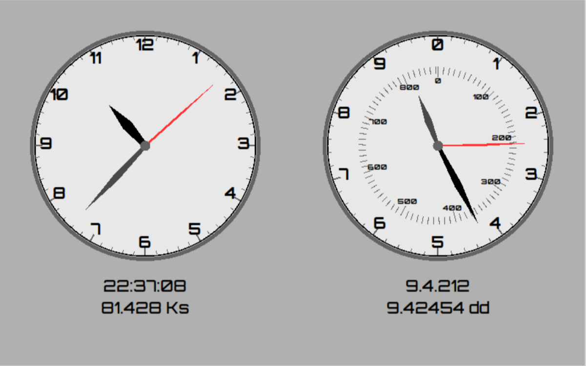

# UTMS - Universal Time Measurement System

#### 🚀 **Revolutionizing How We Measure Time**

The **Universal Time Measurement System (UTMS)** is a bold reimagining
of how humanity measures and communicates time. By leveraging the
fundamental, universal nature of **Planck time units**, this system
transcends the limitations of Earth-centric timekeeping, providing a
framework that is consistent across all observers—no matter their
location, velocity, or frame of reference in the universe.


UTMS introduces an innovative method of tracking time, spanning from
the Big Bang to the eventual heat death of the universe, based on a
decimalized time system. This reimagined timekeeping framework offers
significant advantages.


With UTMS, time measurement becomes:
- **Universal**: Accounts for relativistic effects and cosmic scales.
- **Practical**: Simplifies calculations with a decimal-based hierarchy.
- **Flexible**: Allows for multiple reference points, from the Unix epoch to your birthday.

---

#### 🌌 **The Problem with Current Timekeeping**

Traditional timekeeping systems are based on arbitrary historical and
astronomical events, such as Earth's rotation or the Gregorian
calendar. These systems:
- Lack universality: They cannot account for relativistic effects or cosmic time scales.
- Are overly complex: Using non-decimal units (e.g., 24-hour days, 60-minute hours).
- Are Earth-specific: Useless in contexts beyond our planet.

UTMS redefines time with **Planck time units**—the smallest meaningful
measurement of time—as the foundation. This universal metric is
invariant and provides a consistent reference for all observers,
regardless of relativistic effects.


---

#### 🧮 **Core Features**

1. **Planck Time Units as a Universal Metric**
   Time is measured as the total number of Planck time units since the
   Big Bang. This metric remains consistent for all observers,
   enabling communication across vastly different frames of reference.

2. **Decimal-Based Time Hierarchy**
   UTMS introduces logical, scalable time units:
   - **Kiloseconds (KSec)**: 1,000 seconds (~16.67 minutes)
   - **Megaseconds (MSec)**: 1,000,000 seconds (~11.57 days)
   - **Gigaseconds (GSec)**: 1,000,000,000 seconds (~31.7 years)
   - **Teraseconds (TSec)**: 1,000,000,000,000 seconds (~31,688 years)
   This eliminates the need for inconsistent units like hours, weeks, or months.

3. **Customizable Reference Points**
   Start measuring time relative to any point—be it the Unix epoch,
   the birth of civilization, or this very moment. The flexibility of
   UTMS accommodates both personal and scientific contexts.

4. **Earth-Centric Adaptation for Daily Life**
   Retains the concept of "days" but measures time as seconds since
   midnight, reset daily. This ensures compatibility with routines
   like work schedules while simplifying the traditional 24-hour
   format.

---

#### 🔧 **Applications**

- **Cosmic and Relativistic Communication**: Enable synchronization with observers in different inertial frames, including hypothetical relativistic aliens.
- **Scientific Research**: Provide a consistent framework for measuring time across cosmic and quantum scales.
- **Daily Usability**: Simplify everyday time tracking with decimalized, scalable units.

---

#### 🌟 **Getting Started**

This repository includes:
- A working prototype for calculating time in UTMS units.
- Conversion tools between traditional and UTMS units.
- Examples of how to use UTMS for historical and scientific events.

---

#### 💡 **Future Enhancements**

- Integration with Earth's rotation and celestial mechanics for local adaptability.
- Support for prehistoric and cosmic event timelines.
- Improved tools for visualization and human-centric usability.

---

#### 🤝 **Contribute**

Join us in redefining time!
If you have ideas, suggestions, or code to contribute, feel free to open an issue or submit a pull request.

## Steps to Get Started

### Install UTMS

Make sure [you have pip installed](https://pip.pypa.io/en/stable/installation/), and install UTMS from PyPi:

```bash
$ pip install utms
```

### Configure Gemini API key:

Create an Gemini API key here https://aistudio.google.com/app/apikey and configure it within UTMS:

```bash
$ utms config set gemini.api_key YOUR_API_KEY
```

### Run UTMS


Once the API key is configured, you can run UTMS to query the AI about dates. If you want to just use the prompt simply run `utms`, and besides simply resolving arbitrary string to a time, it also supports several commands:

%%%UTMS_HELP%%%


#### Clocks

To show current time with analog/digital clocks in both standard and decimal times use `utms clock` or run `.clock` command:




#### Convert units

##### Decimal/Duodecimal day times

To convert between day time formats use `daytime convert` commands:

%%%UTMS_DCONV1%%%
%%%UTMS_DCONV2%%%

##### Convert arbitrary time units

Use the `unit convert` command to convert between arbitrary time units:

%%%UTMS_CONV_5H%%%
%%%UTMS_CONV_125S%%%
%%%UTMS_CONV_125SH%%%


#### Look up a date

Just type the date in any format you can think of, and UTMS will try to make sense of it, first using python's dateparser, and if that fails it'll use the Gemini AI to look up any event known to the AI and get a parseable time value out of it:

%%%UTMS_RESOLVE_TODAY%%%
%%%UTMS_RESOLVE_WW2%%%
%%%UTMS_RESOLVE_EXTINCTION%%%
%%%UTMS_RESOLVE_ROMAN%%%


#### Print units conversion table

Use the `.unit` command to display a conversion table between time units:

%%%UTMS_UNITS%%%

If you want to only print the relevant ones, choose the unit you want to center the table to and the number of columns and rows to display inbetween:

%%%UTMS_UNITS_SHORT%%%
